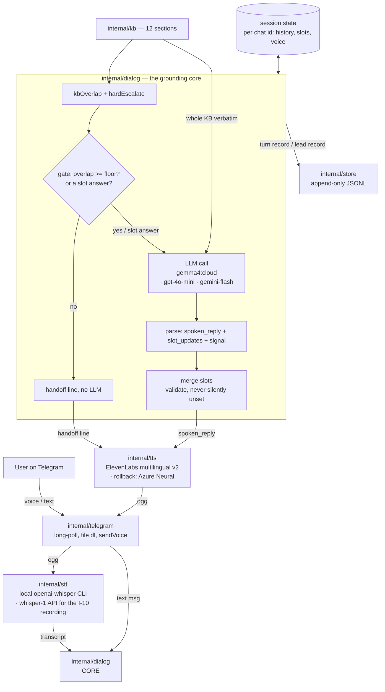

# v2v-demo — architecture

Companion to `docs/requirements.md` (the *what*) and `.agents/plan.md` (the
*how*, file by file). This is the *shape*: components, the turn data flow, and
— the part that drove the design — how the agent's speech is kept coherent and
grounded rather than fluent nonsense.

`D-NN` tags refer to the project's decision log (`.engage/`, local only).

## 1. The one hard problem

The client judges the demo on whether the assistant **sounds natural** — and
they mean two things by it (S2):

1. **Voice** — not robotic. Solved by the TTS choice (ElevenLabs multilingual
   v2 primary, Azure Neural rollback — NFR-1, D-15). Not architecturally
   interesting.
2. **Content** — clear, connected, on-topic sentences; not vague waffle or
   invented facts (NFR-9). This *is* architecturally interesting, and it is
   the reason this document exists.

A fluent voice reading mushy or subtly-wrong answers fails the demo. So the
architecture is built around **grounding**: the whole KB is in the prompt, a
keyword gate + a hard-keyword list catch off-topic and liability questions
before the LLM, and the model is told to hand off rather than guess.

## 2. Components



| Package | Responsibility | Requirements |
|---|---|---|
| `internal/telegram` | Transport only: long-poll `getUpdates`, download voice files, `SendVoice`/`SendText`/`SendRecordingAction`. No command or session logic. | FR-1, FR-3, FR-10, NFR-2 |
| `internal/stt` | `Transcriber` interface, two impls: **`local`** (shell out to the `openai-whisper` CLI, which decodes the ogg via its own ffmpeg call; model name from `WHISPER_MODEL`, default `turbo` (= large-v3-turbo — faster than `medium` on CPU + better Ukrainian) — dev default, free) and **`openai`** (`whisper-1` API — mandatory for the I-10 client recording, CPU-local is too slow live). `STT_BACKEND` selects. | FR-2, D-13 |
| `internal/kb` | Load `KB_PATH`, split on `##` into titled sections — passed to the LLM in full, and to `kbOverlap` | FR-6, NFR-9 |
| `internal/dialog` | `hardEscalate` + `kbOverlap` + grounding gate, LLM orchestration, trailer parse, slot merge, fixed lines. **The core.** LLM call goes through a `Generator` interface: **`ollama`** (Ollama OpenAI-compat, `gemma4:cloud`, dev default), **`openai`** (`gpt-4o-mini`, the client-facing artefact — D-20 dual-mode, for latency), **`gemini`** (native Gemini API, `gemini-flash-latest`; last resort — needs a $25 prepay). `openai_compat.go` (shared by ollama+openai) retries once on a transient. `DIALOG_BACKEND` selects. | FR-4…FR-9, FR-12, NFR-7, NFR-9, D-13, D-20 |
| `internal/tts` | `Synthesizer` interface, two impls: **`elevenlabs`** (`eleven_multilingual_v2`) and **`azure`** (`uk-UA-*Neural`); both retry once on a transient and emit opus-in-ogg. `TTS_BACKEND` selects; **`none`** yields a nil synthesizer and the update loop replies text-only (dev / bulk smoke-testing). Google is a documented third impl, not built (D-15). | FR-10, NFR-1, D-15 |
| `internal/store` | Append-only JSONL: one record per turn; one lead record on `lead_ready` | FR-8, FR-13 |
| `cmd/bot` | Wiring, config, the update loop (per-chat goroutine + locks), `/voice`, the greeting, the recording ticker, STT, store calls | FR-11, NFR-3, NFR-4, NFR-6 |

Runtime dependencies (dev path): a Telegram bot library (Go); a running Ollama
logged in to a Pro/Max account (`gemma4:cloud` dialogue); the `openai-whisper`
CLI + `ffmpeg` on `PATH` (`STT_BACKEND=local`); an ElevenLabs key (TTS).
An **OpenAI key** is needed only for `STT_BACKEND=openai` (the I-10 client
recording) or `DIALOG_BACKEND=openai`; a Gemini key only for
`DIALOG_BACKEND=gemini`; an Azure Speech key only for `TTS_BACKEND=azure`.
All HTTP is stdlib.

## 3. Turn data flow

1. Telegram update arrives. If voice: download OGG to a temp file (path
   validated), transcribe, delete the file. If text: use it directly.
2. `dialog.Handle(ctx, sess, kb, gen, sys, text)` — full pseudocode in
   `.agents/plan.md` §"Behavioural spec":
   a. **`hardEscalate(text)`** — keyword list for liability topics; a hit
      returns the fixed handoff line, no LLM.
   b. **Grounding gate** — `slotAnswer` (short + the bot just asked + a slot
      is nil) bypasses it; otherwise `kbOverlap(text, kb) < gate_floor` (few
      of the message's meaningful terms appear anywhere in the KB) forces the
      handoff line, no LLM (the anti-waffle stop). B1: no per-section
      retrieval — the score only feeds this gate.
   c. **LLM call** — system prompt = `prompt/system.md` + `--- KNOWLEDGE BASE
      ---` + **the whole KB** (every `## Title` + body) + `--- COLLECTED SO
      FAR ---` + the slot state; messages = the last 20 Msg entries (≈10
      turns) + this one. Temperature 0.2–0.3.
   d. **Parse** the response into `{ spoken_reply, slot_updates, signal }`
      where `signal ∈ {continue, lead_ready, escalate}`. Format: the reply
      text, then a fenced JSON trailer the code strips before speaking.
   e. **Merge** `slot_updates` into the session slots — validate types,
      never clear an already-filled slot unless the user explicitly corrected
      it (the LLM is told to send a slot only when newly learned).
   f. Every `escalate` path (gate, parse failure, Generator error, or the
      model's own `signal`) → `spoken_reply` becomes the fixed handoff line,
      session marked escalated. No `continue`->`lead_ready` upgrade — the model
      owns `lead_ready` and only emits it after the read-back summary.
      `lead_ready` → the caller appends a lead record (Zoho-field shape).
3. `tts.Spoken` normalises the reply for the ear (drops markdown, arrow
   shorthand, currency codes), then `tts` synthesises it with the session's
   current voice → OGG. The text message sent alongside keeps the original.
4. Telegram: send the voice note, and the text as a normal message (so the
   client can read what was said).
5. `store` appends the turn record: transcript, reply, signal, matched
   section titles, latency.

## 4. Session & slot state

In-memory `map[chatID]*Session`, dropped on restart (NFR: persistence is
deferred, D-7).

```
Session
  History  []Msg          // last 20 entries (about 10 turns), trimmed
  Slots    QuoteSlots     // 6 optional fields (FR-7)
  Voice    string         // "a" | "b" (FR-11)
  Lang     string         // "uk" | "en" — detectLang (lingua-go) each confident turn; feeds STT + prompt + fixed lines
  Escalated bool
  LeadDone  bool          // a lead_ready already fired -> no duplicate LeadRecord
```

Per-chat turns are processed by one **serial worker goroutine per chat**
(fed by a buffered channel), so they run in arrival order; different chats
run concurrently. A `sync.Mutex` guards the shared maps only.

`QuoteSlots`: `LanguagePair, DocType, Volume, Deadline, Certification,
Delivery` — all `*string` (or small typed enums where the KB constrains the
values). "Lead ready" = all six non-nil. There is no elaborate FSM; the
"state machine" is *which slots are still nil*, and the LLM is prompted to ask
about exactly those.

## 5. Grounding — the mechanism in full (NFR-9)

The model is prevented from waffling by four layers, cheapest first:

1. **Bounded context.** The LLM never sees more than: `prompt/system.md`,
   the **whole KB** (~19 KB — an English block and a Ukrainian block under
   every `## Title`; the bilingual text is what lets `kbOverlap` score a
   Ukrainian query — D-18), the slot state, the last 20 Msg entries. It
   cannot drift into territory it was never given — and with the KB small,
   there is no retrieval to get wrong (B1).
2. **Pre-LLM escalation.** `hardEscalate` (a keyword list for liability
   topics) and the grounding gate (`kbOverlap` below `gate_floor` on a turn
   that is neither a slot answer nor small-talk) both reply with the fixed
   handoff line and never call the LLM. Greetings / thanks / farewells
   (`isSmallTalk`) skip the gate — a dialogue boundary is not a content
   question.
3. **The rules in `prompt/system.md`.** "Answer only from the KNOWLEDGE BASE.
   If it's not covered, set `signal: escalate`. Never state a final price."
   Plus the explicit escalate list. (NFR-7, NFR-9.)
4. **Low temperature + a fixed persona.** 0.2–0.3, and the specific persona +
   playbook in `prompt/system.md` so tone and flow don't wander.

This is the same discipline as `ragline`'s `Decide` function (retrieve →
score → answer-or-escalate); reimplemented here at demo scale, in memory, no
database. `ragline` is the public reference implementation of the pattern at
"real" scale — it is **not** a code dependency (its core lives in `internal/`,
coupled to Postgres, not importable). See §6.

## 6. Dependency decision — settled

| Option | Verdict |
|---|---|
| Depend on `ragline` as a Go module | **No.** Its reusable core is under `internal/` — not importable across modules — and coupled to Postgres repos + JWT + HTTP handlers. Not cleanly extractable without a real refactor of a repo that is "done". |
| Build the demo on `ragivka` (L1 flow) | **No, not for the demo.** Multi-tenant, River queue, prompt registry — overkill for a throwaway. Its runtime state is unverified (`README` says routes 503, `CLAUDE.md` says fully wired). Risk to the 3–5 day timeline. |
| Self-contained demo, pattern reimplemented | **Yes.** ~7 small packages, two dependencies (`go-telegram/bot`; `lingua-go` for language detection — D-19). The retrieve→gate→ground pattern is ~120 LOC, informed by `ragline` (and its `decision.go` may be copied verbatim with attribution if it saves time). |

`ragline` stays the **client-facing proof artifact** — a public GitHub repo
showing the same "knows when it doesn't know" + audit-queue + cache-
invalidation pattern, verified running. `ragivka` stays the **MVP target**.

## 7. How this becomes the MVP (not throwaway thinking)

The demo validates the *conversation design*; the MVP swaps the *substrate*.

| Demo | MVP |
|---|---|
| `dialog.Handle` (transcript + state + KB → reply + state + signal) | L1 orchestrator + a confidence/HITL gate (ragivka's `pkg/orchestrator` + `pkg/tools.HITLGate`, or the equivalent) |
| whole KB in the prompt + kbOverlap gate | SQLite FTS5 + vector search (see §7.1) |
| `map[chatID]*Session`, lost on restart | SQLite `session` table + FSM |
| JSONL turn log | SQLite `message` + `audit_log` tables |
| lead record written to the log | real Zoho lead via REST (`.eu` base) |
| Telegram voice glue in `internal/telegram` | a reusable `channel/voice` adapter |
| gpt-4o-mini, single provider | model router + multi-provider failover |

### 7.1 Datastore (MVP) — SQLite by default

For this project's scale (a translation bureau: tens–hundreds of
conversations/day, a KB in the hundreds–low-thousands of chunks) **SQLite is a
full replacement for Postgres/pgvector, not a compromise.**

| Concern | SQLite approach |
|---|---|
| Keyword retrieval | **FTS5 + BM25** — a direct equivalent of Postgres FTS |
| Vector retrieval | `sqlite-vec` extension, **or** embeddings stored as BLOB with cosine done in Go memory — brute-force over a few thousand vectors is sub-millisecond; HNSW only matters past ~1M |
| Job queue | River is Postgres-only and is dropped. Start **synchronous**; if a specific operation proves too slow, add a `jobs` table + a polling worker |
| Concurrency | WAL mode — many readers + one writer; adequate for this write volume |
| Backup / replication | copy the file, or **Litestream** streaming to an S3 bucket |

**Why it also helps the pitch:** no managed-Postgres line in the monthly
cost; and the GDPR story is simpler — one file, one region, Litestream to an
EU bucket is easy to explain to the client's German customers.

**Escape hatch:** the data layer stays behind an interface, so Postgres
remains a drop-in if sustained high-concurrency writes (many simultaneous
voice calls) ever make the single writer contend. Avoid Postgres-only SQL in
the schema so the migration stays mechanical.

Prefer the pure-Go `modernc.org/sqlite` driver (no CGO); if `sqlite-vec` is
needed, either accept CGO (`mattn/go-sqlite3` + load the extension) or keep
vectors in Go memory and use the pure-Go driver for everything else.

## 8. Failure modes (NFR-4)

| Failure | Behaviour |
|---|---|
| STT error / empty transcript | text reply: "не розчув, повторіть, будь ласка"; log; no LLM call |
| LLM error / unparseable trailer | text reply: apology + "з'єдную з менеджером"; mark escalated; log |
| TTS error | send the reply as **text only**; log |
| Telegram send error | retry once, then log and drop the turn |
| any panic in a handler | recovered in the loop; the bot keeps serving other chats |

The update loop never exits on a per-turn error.
