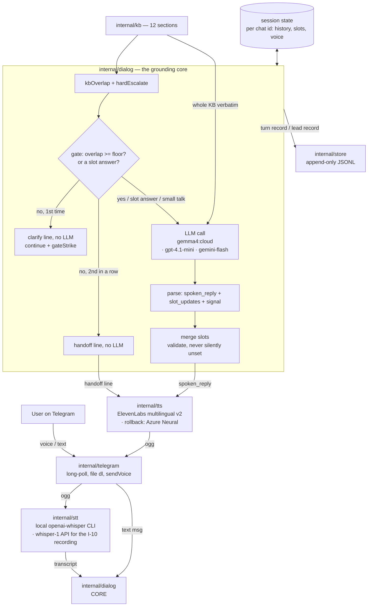

# v2v-demo — architecture

Companion to `docs/requirements.md` (the *what*) and `.agents/plan.md` (the
*how*, file by file). This is the *shape*: components, the turn data flow, and
— the part that drove the design — how the agent's speech is kept coherent and
grounded rather than fluent nonsense.

`D-NN` tags refer to the project's decision log (`.engage/`, local only).

## 1. The one hard problem

The client judges the demo on whether the assistant **sounds natural** — and
they mean two things by it (S2):

1. **Voice** — not robotic. Solved by the TTS choice (ElevenLabs multilingual
   v2 primary, Azure Neural rollback — NFR-1, D-15). Not architecturally
   interesting.
2. **Content** — clear, connected, on-topic sentences; not vague waffle or
   invented facts (NFR-9). This *is* architecturally interesting, and it is
   the reason this document exists.

A fluent voice reading mushy or subtly-wrong answers fails the demo. So the
architecture is built around **grounding**: the whole KB is in the prompt, a
keyword gate + a hard-keyword list catch off-topic and liability questions
before the LLM, and the model is told to hand off rather than guess.

## 2. Components



| Package | Responsibility | Requirements |
|---|---|---|
| `internal/telegram` | Transport only: long-poll `getUpdates`, download voice files, `SendVoice`/`SendText`/`SendRecordingAction`/`SendButtons`/`AnswerCallback`. No command, session, or topic logic. | FR-1, FR-3, FR-10, NFR-2 |
| `internal/stt` | `Transcriber` interface, two impls: **`local`** (shell out to the `openai-whisper` CLI, which decodes the ogg via its own ffmpeg call; model name from `WHISPER_MODEL`, default `turbo` (= large-v3-turbo — faster than `medium` on CPU + better Ukrainian) — dev default, free) and **`openai`** (`whisper-1` API — mandatory for the I-10 client recording, CPU-local is too slow live). `STT_BACKEND` selects; **`none`** yields a nil transcriber and a voice message gets a fixed decline reply, no download/transcribe attempted (symmetric with `TTS_BACKEND=none` below). | FR-2, D-13 |
| `internal/kb` | Load `KB_PATH`, split on `##` into titled sections — passed to the LLM in full, and to `kbOverlap` | FR-6, NFR-9 |
| `internal/dialog` | `hardEscalate` + `kbOverlap` + grounding gate, LLM orchestration, JSON-response parse, slot merge, fixed lines. **The core.** LLM call goes through a `Generator` interface: **`ollama`** (Ollama OpenAI-compat, `gemma4:cloud`, dev default), **`openai`** (`gpt-4.1-mini`, the client-facing artefact — D-20 dual-mode, for latency + rule-following), **`gemini`** (native Gemini API, `gemini-flash-latest`; last resort — needs a $25 prepay). `openai_compat.go` (shared by ollama+openai) retries once on a transient. `DIALOG_BACKEND` selects. | FR-4…FR-9, FR-12, NFR-7, NFR-9, D-13, D-20 |
| `internal/tts` | `Synthesizer` interface, two impls: **`elevenlabs`** (`eleven_multilingual_v2`) and **`azure`** (`uk-UA-*Neural`); both retry once on a transient and emit opus-in-ogg. `TTS_BACKEND` selects; **`none`** yields a nil synthesizer and the update loop replies text-only (dev / bulk smoke-testing). Google is a documented third impl, not built (D-15). | FR-10, NFR-1, D-15 |
| `internal/store` | Append-only JSONL: one record per turn; a lead record on each `lead_ready` that goes through — usually one per chat, two if the client corrects a value after the summary (newest row wins) | FR-8, FR-13 |
| `cmd/bot` | Wiring, config, the update loop (per-chat goroutine + locks), `/voice`, the greeting or topic picker, the recording ticker, STT, store calls | FR-11, NFR-3, NFR-4, NFR-6 |

Runtime dependencies (dev path): a Telegram bot library (Go); a running Ollama
logged in to a Pro/Max account (`gemma4:cloud` dialogue); the `openai-whisper`
CLI + `ffmpeg` on `PATH` (`STT_BACKEND=local`); an ElevenLabs key (TTS).
An **OpenAI key** is needed only for `STT_BACKEND=openai` (the I-10 client
recording) or `DIALOG_BACKEND=openai`; a Gemini key only for
`DIALOG_BACKEND=gemini`; an Azure Speech key only for `TTS_BACKEND=azure`.
All HTTP is stdlib.

## 3. Turn data flow

1. Telegram update arrives. If voice: download OGG to a temp file (path
   validated), transcribe, delete the file. If text: use it directly.
2. `dialog.Handle(ctx, sess, topic, gen, text, now)` — full pseudocode in
   `.agents/plan.md` §"Behavioural spec":
   a. **`hardEscalate(text)`** — keyword list for liability topics; a hit
      returns the fixed handoff line, no LLM.
   b. **Grounding gate** — `slotAnswer` (short + the bot just asked + a slot
      is nil) and small talk bypass it; otherwise `kbOverlap(text, kb) <
      gate_floor` (few of the message's meaningful terms appear anywhere in
      the KB) fires it: **first hit → the fixed `clarifyLine`** ("we only do
      translations", lists missing slots), `continue`, sets `gateStrike`;
      **second consecutive hit → the handoff line**. Both pre-LLM, so no
      hallucination and no possible statement on an off-topic subject. B1: no
      per-section retrieval — the score only feeds this gate.
   c. **LLM call** — system prompt = the topic's system.md + `--- KNOWLEDGE
      BASE ---` + **the whole KB** (every `## Title` + body) + `--- COLLECTED
      SO FAR ---` + the slot state + `--- RESPONSE FORMAT ---` (the JSON shape
      + the topic's slot keys, generated from its SlotSpec list) + `---
      CONVERSATION LANGUAGE ---` + `--- CURRENT
      TIME ---` (local time in `BOT_TIMEZONE` + an office-open flag computed in
      Go — the bot has no clock, so this is injected every turn and drives the
      "~15 min vs next business morning" promise); messages = the last 20 Msg
      entries (≈10 turns) + this one. Temperature 0.2–0.3.
   d. **Parse** the response — one JSON object `{"reply","slots","signal"}`,
      `signal ∈ {continue, lead_ready, escalate}`. Only `reply` is spoken. Each
      backend forces valid JSON its own way ("model connection context"):
      OpenAI sets `response_format: json_object` (gpt-4o-mini drops the object
      on trivial turns otherwise); Ollama relies on the prompt; a gemini path
      would use `responseMimeType`.
   e. **Merge** `slot_updates` into the session slots — validate types,
      never clear an already-filled slot unless the user explicitly corrected
      it (the LLM is told to send a slot only when newly learned).
   f. Every `escalate` path (a second gate hit, parse failure, Generator
      error, or the model's own `signal`) → `spoken_reply` becomes the fixed
      handoff line, session marked escalated. No `continue`->`lead_ready`
      upgrade — the model owns `lead_ready`. `lead_ready` → the caller appends
      a lead record; a post-summary correction appends a fresh one (newest
      wins).
3. `tts.Spoken` normalises the reply for the ear (drops markdown, arrow
   shorthand, currency codes), then `tts` synthesises it with the session's
   current voice → OGG. The text message sent alongside keeps the original.
4. Telegram: send the voice note, and the text as a normal message (so the
   client can read what was said).
5. `store` appends the turn record: transcript, reply, signal, matched
   section titles, latency.

## 4. Session & slot state

`SESSION_STORE` (default `memory`) picks the backend behind `cmd/bot`'s
`sessionStore` interface (`Load`/`Save`/`Delete`/`Close`):

- `memory` — a `map[chatID][]byte` of the same JSON encoding the SQLite
  backend uses, dropped on restart.
- `sqlite` — `internal/store.SQLiteSessions` (`modernc.org/sqlite`, no cgo;
  `SESSION_DB_PATH`, default `./data/sessions.db`), survives a restart.

Both are **copy-semantics**: `Load` always hands back a session decoded
fresh from storage, never a pointer aliased to what the store holds.
`cmd/bot.handleUpdate` reads and writes through exactly one load/save pair
per update (`Load` at the top, a deferred `Save` — skipped only when the
turn deleted the session via `/reset`), so a mutation that forgot to persist
fails identically under either backend instead of only surfacing after
switching to `sqlite`.

```
Session
  History    []Msg              // last 20 entries (about 10 turns), trimmed
  Slots      map[string]string  // keyed by the topic's SlotSpec.Key (FR-7); nil until the first write
  Voice      string             // "a" | "b" (FR-11)
  Lang       string       // "uk" | "en" — detectLang (lingua-go) each confident turn; feeds STT + prompt + fixed lines
  Escalated  bool
  LeadDone   bool         // a lead_ready already fired this session
  LeadSlots  string       // slot JSON at the last lead — repeat lead_ready: same slots -> continue, changed -> a corrected LeadRecord
  GateStrike bool         // two-strike grounding-gate counter (§5)
  Topic      string       // which topics.json bundle this session belongs to
```

Per-chat turns are processed by one **serial worker goroutine per chat**
(fed by a buffered channel), so they run in arrival order; different chats
run concurrently. A `sync.Mutex` guards the shared `inbox` map only —
session state goes through `sessionStore`, not a locked map, now that
either backend can be swapped in.

**Slots are per-topic.** Each topic (`topics.json`) declares an ordered
`[]SlotSpec` (`{key, ask_uk, ask_en, rule}`); `Session.Slots` and the lead
record are `map[string]string` keyed by `SlotSpec.Key`. The translation
topic's keys: `language_pair, doc_type, volume, deadline, certification,
delivery`. "Lead ready" = every declared key has a non-empty value
(`dialog.Complete(slots, spec)`). No FSM; the "state machine" is *which keys
are still empty*, and the LLM is prompted — via `--- COLLECTED SO FAR ---`
plus a generated `--- RESPONSE FORMAT ---` block listing the topic's keys —
to ask about exactly those. The merge filters incoming values to the
topic's declared keys, so a model-invented key can't pollute the state.

### 4.1 Topics — multiple assistants on one bot

`TOPICS_PATH` (default `topics/topics.json`, see `topics/README.md`)
configures **genuinely distinct assistants** behind one bot — each topic is
its own KB + system prompt + greeting + slot schema, not a KB slice of one
persona. `cmd/bot.loadTopics` builds `app.topics map[string]topicBundle`
(each holding a `dialog.TopicSpec`) and `app.topicIDs []string` (display
order) from the manifest, falling back to one synthetic topic
(`KB_PATH`/`SYSTEM_PROMPT_PATH`/`GREETING_PATH` + the translation slot
schema) when the manifest is missing or empty. **The repo ships a
one-topic `topics.json`, so the picker below does not appear by default;**
2+ entries turn it on.

With 2+ topics, first contact sends a Telegram inline keyboard (one button
per topic) instead of the plain greeting; tapping a button is a
`callback_query` update (`internal/telegram` normalises it to
`Update.CallbackData`/`CallbackID`) that sets `Session.Topic`, acks via
`AnswerCallback` (required or the tap shows a permanent spinner), and sends
that topic's own greeting. `/voice` and `/reset` work regardless of topic
state; any other text before a topic is chosen re-shows the picker instead
of guessing which assistant should answer.

## 5. Grounding — the mechanism in full (NFR-9)

The model is prevented from waffling by four layers, cheapest first:

1. **Bounded context.** The LLM never sees more than: `topics/translation/system.md`,
   the **whole KB** (~19 KB — an English block and a Ukrainian block under
   every `## Title`; the bilingual text is what lets `kbOverlap` score a
   Ukrainian query — D-18), the slot state, the last 20 Msg entries. It
   cannot drift into territory it was never given — and with the KB small,
   there is no retrieval to get wrong (B1).
2. **Pre-LLM escalation.** `hardEscalate` (a keyword list for liability
   topics) and the grounding gate (`kbOverlap` below `gate_floor` on a turn
   that is neither a slot answer nor small-talk) both reply with the fixed
   handoff line and never call the LLM. Greetings / thanks / farewells
   (`isSmallTalk`) skip the gate — a dialogue boundary is not a content
   question.
3. **The rules in `topics/translation/system.md`.** "Answer only from the KNOWLEDGE BASE.
   If it's not covered, set `signal: escalate`. Never state a final price."
   Plus the explicit escalate list. (NFR-7, NFR-9.)
4. **Low temperature + a fixed persona.** 0.2–0.3, and the specific persona +
   playbook in `topics/translation/system.md` so tone and flow don't wander.

This is the same discipline as `ragline`'s `Decide` function (retrieve →
score → answer-or-escalate); reimplemented here at demo scale, in memory, no
database. `ragline` is the public reference implementation of the pattern at
"real" scale — it is **not** a code dependency (its core lives in `internal/`,
coupled to Postgres, not importable). See §6.

## 6. Dependency decision — settled

| Option | Verdict |
|---|---|
| Depend on `ragline` as a Go module | **No.** Its reusable core is under `internal/` — not importable across modules — and coupled to Postgres repos + JWT + HTTP handlers. Not cleanly extractable without a real refactor of a repo that is "done". |
| Build the demo on `ragivka` (L1 flow) | **No, not for the demo.** Multi-tenant, River queue, prompt registry — overkill for a throwaway. Its runtime state is unverified (`README` says routes 503, `CLAUDE.md` says fully wired). Risk to the 3–5 day timeline. |
| Self-contained demo, pattern reimplemented | **Yes.** ~7 small packages, two dependencies (`go-telegram/bot`; `lingua-go` for language detection — D-19). The retrieve→gate→ground pattern is ~120 LOC, informed by `ragline` (and its `decision.go` may be copied verbatim with attribution if it saves time). |

`ragline` stays the **client-facing proof artifact** — a public GitHub repo
showing the same "knows when it doesn't know" + audit-queue + cache-
invalidation pattern, verified running. `ragivka` stays the **MVP target**.

## 7. How this becomes the MVP (not throwaway thinking)

The demo validates the *conversation design*; the MVP swaps the *substrate*.

| Demo | MVP |
|---|---|
| `dialog.Handle` (transcript + state + KB → reply + state + signal) | L1 orchestrator + a confidence/HITL gate (ragivka's `pkg/orchestrator` + `pkg/tools.HITLGate`, or the equivalent) |
| whole KB in the prompt + kbOverlap gate | SQLite FTS5 + vector search (see §7.1) |
| `sessionStore`: memory (default) or SQLite session persistence (§4) — done today, opt-in | full FSM on top of the SQLite `session` table |
| JSONL turn log | SQLite `message` + `audit_log` tables |
| lead record written to the log | real Zoho lead via REST (`.eu` base) |
| Telegram voice glue in `internal/telegram` | a reusable `channel/voice` adapter |
| single provider (gpt-4.1-mini) | model router + multi-provider failover |

### 7.1 Datastore (MVP) — SQLite by default

For this project's scale (a translation bureau: tens–hundreds of
conversations/day, a KB in the hundreds–low-thousands of chunks) **SQLite is a
full replacement for Postgres/pgvector, not a compromise.**

| Concern | SQLite approach |
|---|---|
| Keyword retrieval | **FTS5 + BM25** — a direct equivalent of Postgres FTS |
| Vector retrieval | `sqlite-vec` extension, **or** embeddings stored as BLOB with cosine done in Go memory — brute-force over a few thousand vectors is sub-millisecond; HNSW only matters past ~1M |
| Job queue | River is Postgres-only and is dropped. Start **synchronous**; if a specific operation proves too slow, add a `jobs` table + a polling worker |
| Concurrency | WAL mode — many readers + one writer; adequate for this write volume |
| Backup / replication | copy the file, or **Litestream** streaming to an S3 bucket |

**Why it also helps the pitch:** no managed-Postgres line in the monthly
cost; and the GDPR story is simpler — one file, one region, Litestream to an
EU bucket is easy to explain to the client's German customers.

**Escape hatch:** the data layer stays behind an interface, so Postgres
remains a drop-in if sustained high-concurrency writes (many simultaneous
voice calls) ever make the single writer contend. Avoid Postgres-only SQL in
the schema so the migration stays mechanical.

Prefer the pure-Go `modernc.org/sqlite` driver (no CGO); if `sqlite-vec` is
needed, either accept CGO (`mattn/go-sqlite3` + load the extension) or keep
vectors in Go memory and use the pure-Go driver for everything else.

## 8. Failure modes (NFR-4)

| Failure | Behaviour |
|---|---|
| STT error / empty transcript | text reply: "не розчув, повторіть, будь ласка"; log; no LLM call |
| LLM error / unparseable trailer | text reply: apology + "з'єдную з менеджером"; mark escalated; log |
| TTS error | send the reply as **text only**; log |
| Telegram send error | retry once, then log and drop the turn |
| any panic in a handler | recovered in the loop; the bot keeps serving other chats |

The update loop never exits on a per-turn error.
